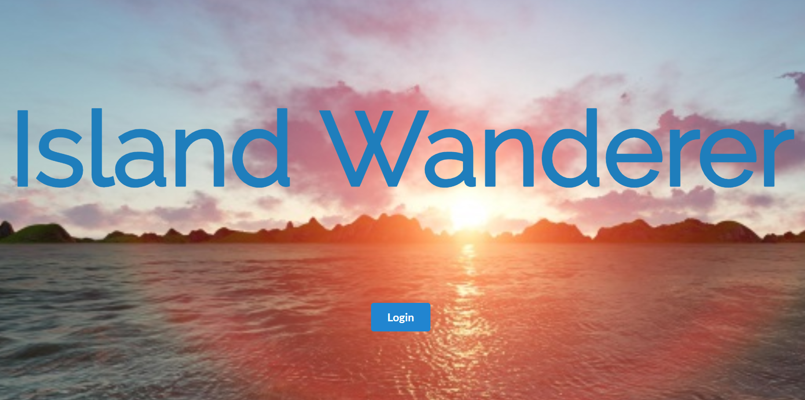

Island Wanderer is a web application that I helped create as a team project in ICS 314, Fall 2017. We were not able to meet the goals of the project. Even so, the project helped me learn how to design and implement a responsive web site and has given me valuable experience working on team proejcts. 

Island Wanderer is implemented using [Meteor](http://meteor.com), a JavaScript application platform. 

In this project I gained experience with full-stack web application design and associated technologies, including [MongoDB](http://mongodb.com) for database storage, and Javascript for both client and server-side programming. 
 
 Island Wanderer was to be an app for UH students to plan and organize events. There are many out of island students at UH who miss out on the chance to explore the island because they don't know what to do or who to go with. There are many residential students who don't explore the island because they've taken it all for granted. This app would have facilitated those needs making it easy for students to create events and connect with other students.
 
 The biggest takeaway from this project would be the important of communication. As a group we decided what we were each going to do early on and worked independently towards those objectives. However we failed to properly communicate the troubles we encountered. This meant that we were not up-to-date about each other's progress and setbacks. This lead to differences in the active collection and the initial collection we used to test the auxillary functions. In the minutes before midnight we tried unsuccessfully to merge the individual branchs encountering clashes in the collections. 
 
 If I could go back and redo this project I would establish all the collections at the start and set smaller goals. The collections used were created individually but used collectively. The whole team needs to be on the same page during all stages of the project, from knowing about changes to the schema to changes about the layout. The goals set at the beginning of the project were focused on the major aspects of the project and spanned weeks.  In failing to set smaller goals I failed to pace myself accordingly. 
 
 I believe that being scared of something is a good thing. It means you care. It means you aren't complacent. I wasn't scared enough of this project because I didn't understand the magnitude as I should have and I reverted into my intoverted habits. 
 
 
 
Source: <a href="https://islandwanderer.github.io"><i class="large github icon"></i>IslandWanderer/islandwanderer</a>
